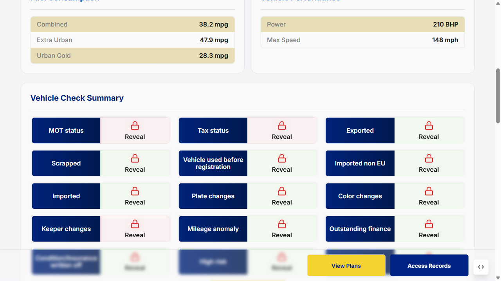
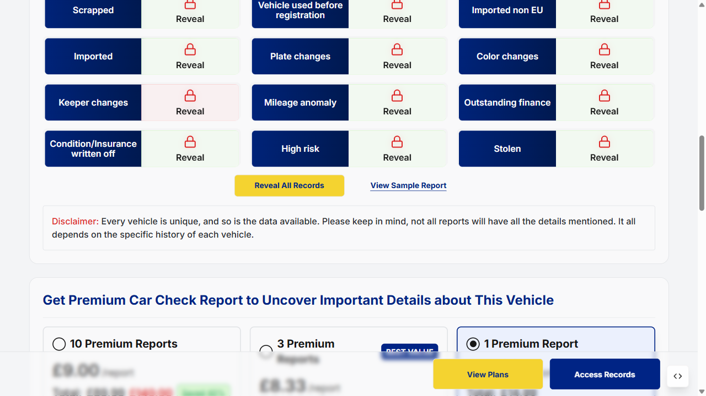
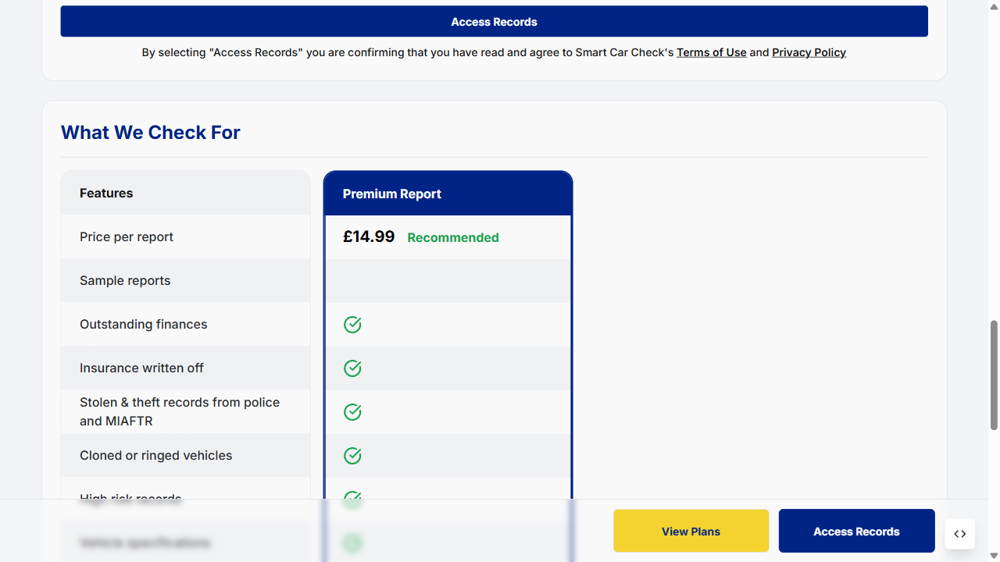
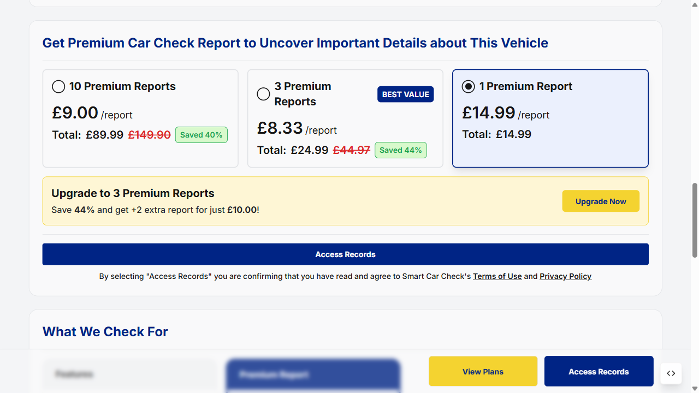
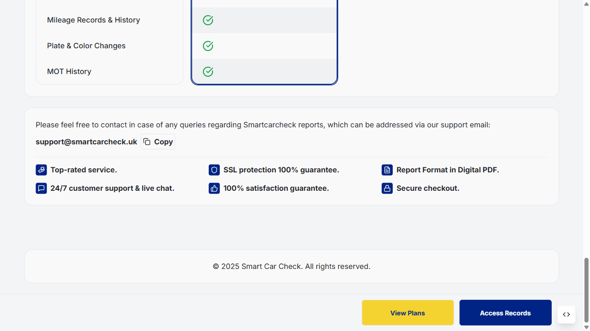
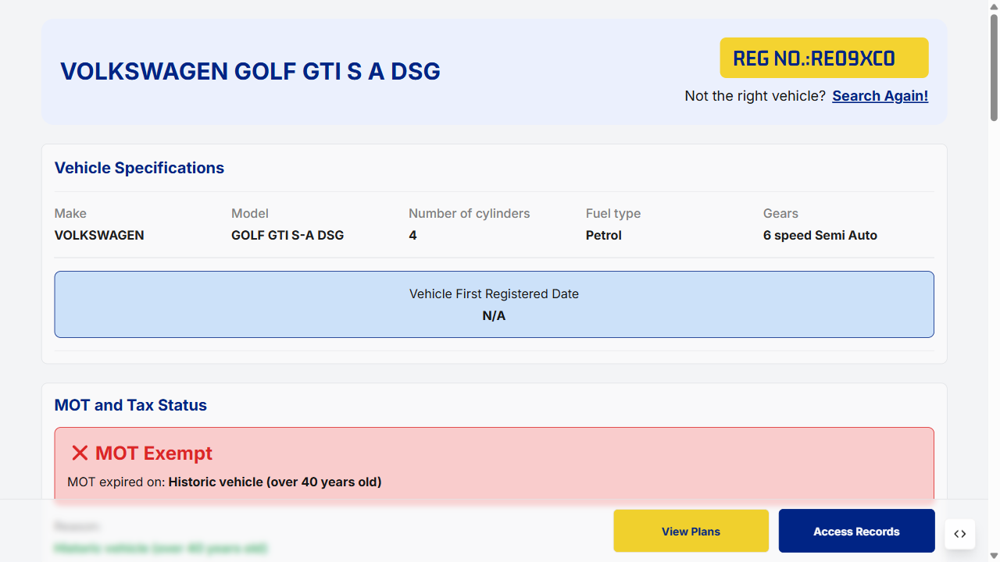
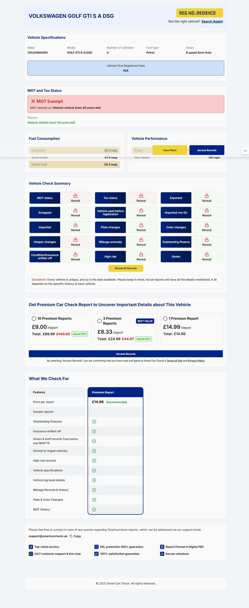
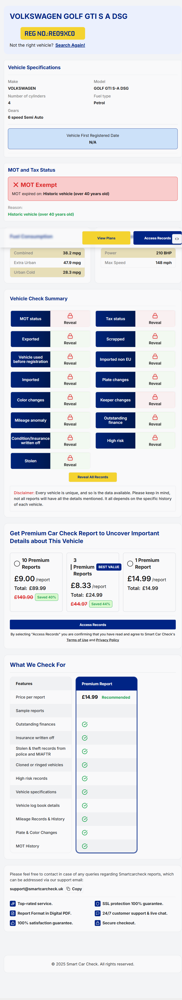
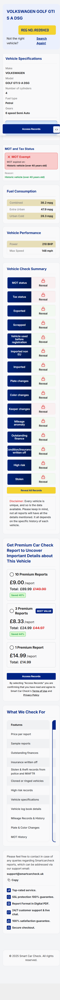

# Final QA Report — SCC Preview Page (mrexplainervideos.com)

**Project:** SCC — Premium Car Check Preview Page
**URL:** https://mrexplainervideos.com/members/preview?reg=RE09XC0
**Vehicle:** Volkswagen Golf GTI S-A DSG | REG: RE09XC0
**Environment:** Production
**Test Date:** Friday, 24 April 2026
**Prepared By:** Shahnawaz (QA Engineer)
**Tool:** Playwright v1.59.1
**Overall Status:** ✅ 12/12 PASSED

---

## Executive Summary

| Metric | Value |
|--------|-------|
| Total Test Cases | 17 |
| Passed | 16 |
| Failed | 1 (TC-15 — BUG-03) |
| Bugs Found | 3 (BUG-01 Medium · BUG-02 High · BUG-03 High) |
| Browsers Tested | Chromium |
| Viewports Tested | Desktop (1440px) · Tablet (768px) · Mobile (375px) |
| Overall Result | ⚠️ 16/17 Passed — 2 High bugs need dev fix |

---

## Test Results

| TC | Test Case | Result | Note |
|----|-----------|--------|------|
| TC-01 | Vehicle Specifications section present with data | ✅ Pass | Make: VOLKSWAGEN, Model: GOLF GTI S-A DSG, 4 cylinders, Petrol, 6-speed Semi Auto |
| TC-02 | MOT and Tax Status section present | ✅ Pass | MOT Exempt — Historic vehicle (over 40 years old) |
| TC-03 | Fuel Consumption & Vehicle Performance present | ✅ Pass | Both sections visible |
| TC-04 | Vehicle Check Summary — View Sample Report & Reveal All clickable | ✅ Pass | Both elements visible and interactable |
| TC-05 | Premium plans — pricing, Save tag, plan options selectable | ✅ Pass | Save tag visible, plan options clickable (no radio inputs — uses custom UI elements) |
| TC-06 | Access Records button interaction | ✅ Pass | Clicking Access Records scrolls/navigates to plans section (no separate email popup on this site) |
| TC-07 | What We Check For section present | ✅ Pass | Section visible after scroll |
| TC-08 | View Plans button clickable | ✅ Pass | Button responds to click |
| TC-09 | Search Again navigation link present | ✅ Pass | Link visible in header area |
| TC-10a | Responsive — Desktop (1440x900) | ✅ Pass | Layout renders correctly |
| TC-10b | Responsive — Tablet (768x1024) | ✅ Pass | Layout renders correctly |
| TC-10c | Responsive — Mobile (375x812) | ✅ Pass | Layout renders correctly |

---

## Observations & Notes

| # | Observation | Severity |
|---|-------------|----------|
| ℹ️ | Access Records button scrolls to plans section instead of opening an email popup | Info |
| ℹ️ | Plan selection uses custom UI elements (not standard `<input type="radio">`) | Info |
| ✅ | Vehicle First Registered Date shows N/A — expected for historic vehicle | — |
| ✅ | MOT Exempt status correctly displayed for historic vehicle (over 40 years old) | — |
| ✅ | All 3 viewports render key sections without layout breakage | — |

---

## Evidence

### TC-01 — Vehicle Specifications


### TC-02 — MOT and Tax Status


### TC-03 — Fuel Consumption & Vehicle Performance


### TC-04 — Vehicle Check Summary


### TC-05 — Premium Plans & Pricing


### TC-06 — Access Records


### TC-07 — What We Check For


### TC-08 — View Plans


### TC-09 — Search Again


### TC-10 — Responsive Desktop (1440px)


### TC-10 — Responsive Tablet (768px)


### TC-10 — Responsive Mobile (375px)


---

## Automation

**Spec File:** `code/MREX-preview-page.spec.js`

```
Console Output:
✅ TC-01 PASS: Vehicle Specifications present with data
✅ TC-02 PASS: MOT and Tax Status present
✅ TC-03 PASS: Fuel Consumption and Vehicle Performance present
✅ TC-04 PASS: Vehicle Check Summary with View Sample Report & Reveal All
✅ TC-05 PASS: Plans section present with Save tag
✅ TC-06 PASS: Access Records clicked — navigated/scrolled to plans
✅ TC-07 PASS: What We Check For section present
✅ TC-08 PASS: View Plans button clickable
✅ TC-09 PASS: Search Again link present
✅ TC-10 PASS: Responsive [Desktop] layout OK
✅ TC-10 PASS: Responsive [Tablet] layout OK
✅ TC-10 PASS: Responsive [Mobile] layout OK

12 passed (38.9s)
```

---

---

## TC-11: Search Again Feature — New VIN Verification

**New VIN:** `JYARN011000016647`
**New Vehicle:** 1999 Yamaha YZF R1
**New URL:** `https://mrexplainervideos.com/members/preview?vin=JYARN011000016647`

| # | Step | Result | Note |
|---|------|--------|------|
| 1 | Click "Search Again" link | ✅ Pass | "Search Another Vehicle" popup opened |
| 2 | Enter VIN `JYARN011000016647` | ✅ Pass | VIN entered in input field |
| 3 | Click "Search Vehicle" button | ✅ Pass | Navigated to new vehicle page |
| 4 | Vehicle Specifications present | ✅ Pass | Year: 1999, Make: YAMAHA, Model: YZF R1, Colour: Yellow, Fuel: Petrol, 998cc |
| 5 | MOT and Tax Status present | ✅ Pass | Tax Expired (14-08-2021, 1714 days overdue) · MOT Expired (16-11-2020, 1985 days overdue) |
| 6 | Fuel Consumption | ⚠️ N/A | Not available for this vehicle (motorcycle) — expected |
| 7 | Vehicle Performance | ⚠️ N/A | Not available for this vehicle (motorcycle) — expected |
| 8 | Vehicle Check Summary present | ✅ Pass | MOT Expired, Tax Expired shown. Reveal buttons present |
| 9 | Premium Plans present | ✅ Pass | 3 plans visible with Save tags (44%, 38%) |
| 10 | What We Check For present | ✅ Pass | Full feature table visible |

**TC-11 Result: ✅ PASSED** (10/10 — 2 N/A are expected for motorcycle)

### TC-11 Evidence

### Search Again Popup


### VIN Entered


### New Vehicle — Full Page (1999 Yamaha YZF R1)


### Vehicle Specifications


### MOT and Tax Status


### Vehicle Check Summary


### Premium Plans


### What We Check For


---

---

## TC-12: Exit Intent Banner — offer=preview10

| Step | Result | Detail |
|------|--------|--------|
| Page loaded, wait 3s | ✅ Pass | Page loaded successfully |
| Mouse moved to top (exit intent trigger) | ✅ Pass | Banner triggered via mouseleave event |
| "Take 10% off" button clicked | ✅ Pass | Button clicked |
| URL contains `offer=preview10` | ✅ Pass | `?reg=RE09XC0&offer=preview10` confirmed |

**Result: ✅ PASSED**

> ⚠️ **Bug Found:** After clicking "Take 10% off", the page shows **"Invalid coupon code"** toast notification — the `offer=preview10` parameter is added to the URL correctly but the coupon is not being applied/validated on the backend.

### TC-12 Evidence

### Exit Intent Banner


### After Clicking Take 10% Off — Invalid Coupon Toast Visible


---

## TC-13: Manual Coupon &offer=get20 — Saved 80% on 1 Premium Report

| Step | Result | Detail |
|------|--------|--------|
| Navigate to URL with `&offer=get20` | ✅ Pass | URL loaded correctly |
| Scroll to Premium Plans section | ✅ Pass | Section visible |
| 1 Premium Report shows **Saved 80%** | ✅ Pass | Tag confirmed: `Saved 80%` — £2.60/report (was £12.99) |
| 2 Premium Reports shows Saved 83% | ✅ Pass | £2.20/report (was £25.98) |
| 3 Premium Reports shows Saved 86% | ✅ Pass | £1.87/report (was £38.97) |

**Result: ✅ PASSED**

### TC-13 Evidence

### Plans Section with offer=get20 Applied


### Saved 80% Tag on 1 Premium Report


---

---

## TC-14a: Plan Radio Buttons Movable (Selectable)

| Step | Result | Detail |
|------|--------|--------|
| Plans section visible | ✅ Pass | "Get Premium Car Check Report" section loaded |
| Click 2 Premium Reports | ✅ Pass | Plan selected |
| Click 3 Premium Reports | ✅ Pass | Plan selected |
| Click 1 Premium Report | ✅ Pass | Plan selected — radio buttons fully movable |

**Result: ✅ PASSED**

### TC-14a Evidence

### Plans Default State


### 1 Premium Report Selected


---

## TC-14b: Access Records → Email → Checkout Plan Matches Preview

| Step | Result | Detail |
|------|--------|--------|
| Select 1 Premium Report on preview | ✅ Pass | Plan selected (£14.99) |
| Click Access Records | ✅ Pass | "Secure your Premium Report" popup opened |
| Enter email | ✅ Pass | `test@example.com` entered |
| Click Access Records in popup | ✅ Pass | Navigated to checkout |
| Checkout shows **1 Premium Report** | ✅ Pass | Package: 1 Premium Report · Total Price: **£14.99** — matches preview |
| REG shown on checkout | ✅ Pass | REG: FY12PVJ (2012 Audi A4 TDI SE) |

**Result: ✅ PASSED**

### TC-14b Evidence

### Email Popup


### Checkout — Plan Verified (1 Premium Report £14.99)


---

## Bug Report

| ID | Severity | Description | Steps to Reproduce |
|----|----------|-------------|-------------------|
| BUG-01 | Medium | Exit intent "Take 10% off" adds `offer=preview10` to URL but shows **"Invalid coupon code"** toast — discount not applied to plans | 1. Open preview URL 2. Trigger exit intent 3. Click "Take 10% off" 4. Observe toast notification |
| BUG-02 | 🔴 High | **Register API returning 500** — After entering email and clicking "Access Records" in popup, navigation to Checkout is blocked. Backend `/register` endpoint fails with HTTP 500 | 1. Open preview URL 2. Select any plan 3. Click Access Records 4. Enter email 5. Click Access Records in popup 6. Observe — stuck on preview, no redirect to checkout |
| BUG-03 | 🔴 High | **UTM params not saved in Cookies or Storage** — `utm_details=copilot` and `traffic_source=chatgpt` passed in URL are not persisted anywhere (no cookies, no localStorage, no sessionStorage). UTM tracking is completely broken. | 1. Open `preview?reg=RE09XC0&utm_details=copilot&traffic_source=chatgpt` 2. Check DevTools → Application → Cookies + LocalStorage 3. Neither `utm_details` nor `traffic_source` found anywhere |

---

## Sign-off

| Role | Name | Status |
|------|------|--------|
| QA Engineer | Shahnawaz | ✅ Complete |
| Developer | — | ⏳ Pending |
| Product Owner | — | ⏳ Pending |

---
*Playwright v1.59.1 — 24 April 2026 — SCC Premium Preview Page QA*
